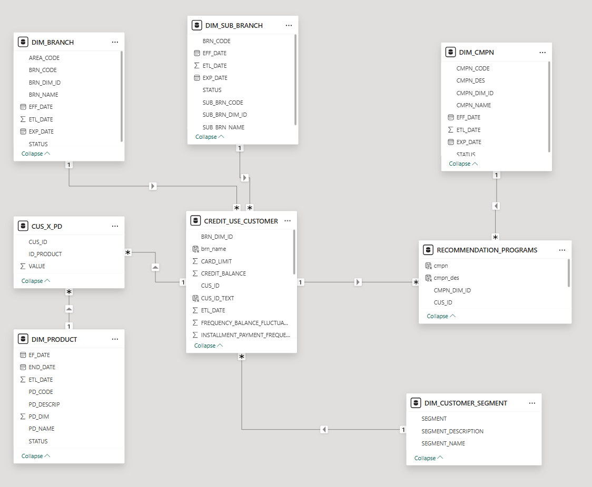
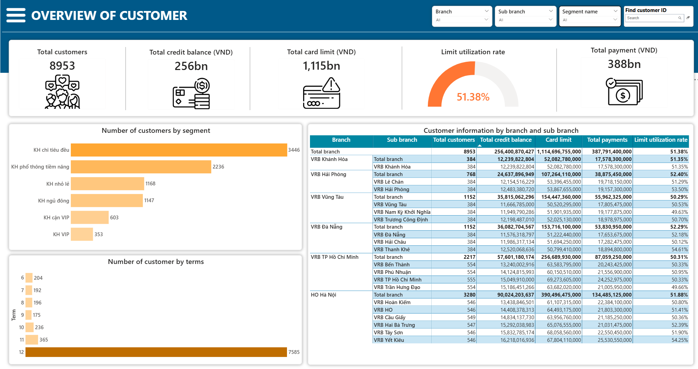
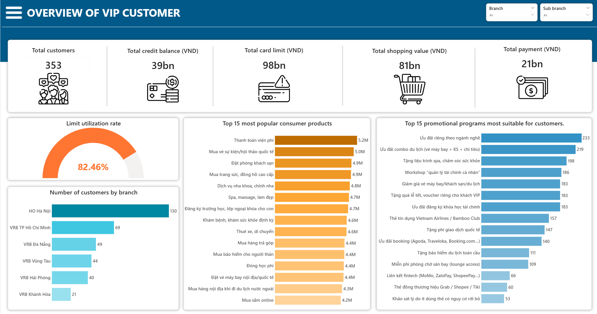
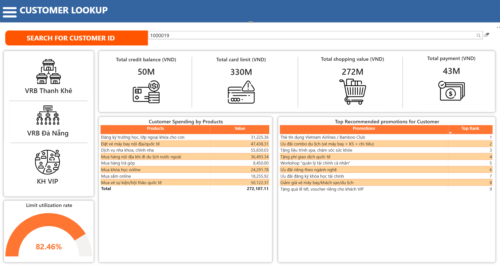

# A Gaussian Mixture Model (GMM) Approach for Customer Segmentation and Personalized Promotion Recommendation in Banking

An end-to-end Machine Learning project for **customer segmentation** and **personalized promotion recommendation** in the banking industry using:

- Gaussian Mixture Model (GMM)
- Content-Based Filtering
- TF-IDF Vectorization
- Cosine Similarity
- Power BI Dashboard Visualization

---
---

# Star Schema Data Model

This project also builds a **Star Schema Data Model** to support dashboard visualization and analytical reporting in Power BI.

The Star Schema design helps organize customer, product, promotion, branch, and recommendation data into a structured analytical model. This makes it easier to create relationships, filter data, and analyze customer segments and recommended programs.

## Data Model Preview



## Main Tables

### Fact Tables

- **FACT_CUSTOMER_SEGMENT**
  - Stores customer segmentation results generated from the GMM model.
  - Includes customer ID, segment ID, segment name, and key behavioral indicators.

- **FACT_RECOMMENDATION_PROGRAMS**
  - Stores recommended promotional programs for each customer.
  - Includes customer ID, campaign ID, similarity score, ranking, and recommendation type.

### Dimension Tables

- **DIM_CUSTOMER_SEGMENT**
  - Describes each customer segment such as VIP customers, inactive customers, potential customers, and small retail customers.

- **DIM_PRODUCT**
  - Contains product information used in the recommendation system.

- **DIM_CMPN**
  - Contains promotional campaign information, including campaign name and campaign description.

- **DIM_BRANCH**
  - Stores branch and sub-branch information for customer location analysis.

## Purpose of the Data Model

The Star Schema is designed to:

- Connect customer segmentation results with recommendation outputs
- Support Power BI dashboard filtering and drill-down analysis
- Enable customer-level and segment-level performance tracking
- Improve the readability and scalability of the analytical model
- Support business users in understanding which campaigns are suitable for each customer group

---
# Dashboard Preview

## Customer Overview Dashboard



---

## VIP Customer Dashboard



---

## Customer Lookup Dashboard



---

#  Project Overview

This project focuses on solving two major business problems in banking:

1. **Customer Segmentation**
   - Identify customer groups based on credit card spending behavior.
   - Support banks in understanding customer financial behavior patterns.

2. **Personalized Promotion Recommendation**
   - Recommend suitable promotional programs for each customer.
   - Improve marketing effectiveness and customer personalization.

The system combines:
- **Gaussian Mixture Model (GMM)** for customer segmentation
- **Content-Based Filtering** for personalized recommendation generation

---

# Objectives

- Segment banking customers using behavioral transaction data
- Build a recommendation engine for banking promotions
- Optimize marketing campaign effectiveness
- Increase customer engagement and loyalty
- Demonstrate practical deployment using Power BI dashboards

---

# Technologies Used

## Programming Language
- Python

## Machine Learning & Recommendation
- Scikit-learn
- Gaussian Mixture Model (GMM)
- TF-IDF Vectorizer
- Cosine Similarity

## Data Processing
- Pandas
- NumPy

## Visualization
- Power BI
- Matplotlib
- Seaborn

## Model Storage
- Joblib
- Pickle

---

#  System Architecture

## Business Pipeline

1. Collect customer transaction data
2. Preprocess and normalize data
3. Perform customer segmentation using GMM
4. Build customer behavior profiles
5. Generate recommendation vectors
6. Recommend suitable promotions
7. Visualize insights using Power BI

---

#  Project Structure

```bash
project/
│
├── Data/
│   ├── CREDIT_USE_DATA.csv
│   ├── CUS_X_PD.csv
│   ├── DIM_PRODUCT.csv
│   ├── PD_X_CMPN.csv
│   ├── DIM_CMPN.csv
│   └── CUS_X_BRN.csv
│
├── images/
│   ├── customer_overview.png
│   ├── vip_dashboard.png
│   └── customer_lookup.png
│
├── save_model/
│   ├── gmm_model.pkl
│   └── scaler.pkl
│
├── save_recommend_model/
│   ├── tfidf_vectorizer.pkl
│   ├── customer_profile_vectors.pkl
│   ├── segment_vecs.pkl
│   └── program_vecs.pkl
│
├── customer_segment_model.ipynb
├── recommendation_model.ipynb
├── full_pipeline_gmm_recommend.py
└── README.md
```

---

# Customer Segmentation

## Segmentation Method

The project uses:
- **Gaussian Mixture Model (GMM)**

### Why GMM?

GMM was selected because:
- Banking customer behavior is highly overlapping
- Customers may belong to multiple behavioral patterns
- GMM supports probabilistic clustering
- Better handling of non-spherical clusters compared to K-Means

---

# Customer Segments

The system classifies customers into 6 main groups:

| Cluster | Segment Name |
|---|---|
| 0 | KH VIP |
| 1 | KH ngủ đông |
| 2 | KH cận VIP |
| 3 | KH chi tiêu đều |
| 4 | KH phổ thông tiềm năng |
| 5 | KH nhỏ lẻ |

---

# Recommendation System

## Recommendation Technique

The project uses:
- **Content-Based Filtering**

## Recommendation Workflow

1. Build customer spending profiles
2. Vectorize products and promotions using TF-IDF
3. Calculate similarity scores using cosine similarity
4. Recommend Top-N promotional programs

---

# Evaluation Metrics

The recommendation system is evaluated using:

- Hit Rate@K
- Precision@K
- Similarity Score Distribution

---

# Installation

## Clone Repository

```bash
git clone <your-repository-url>
cd project
```

## Install Dependencies

```bash
pip install -r requirements.txt
```

---

# Running the Project

## Run Customer Segmentation Notebook

```bash
jupyter notebook customer_segment_model.ipynb
```

## Run Recommendation Notebook

```bash
jupyter notebook recommendation_model.ipynb
```

## Run Full Integrated Pipeline

```bash
python full_pipeline_gmm_recommend.py
```

---
---

ses.
